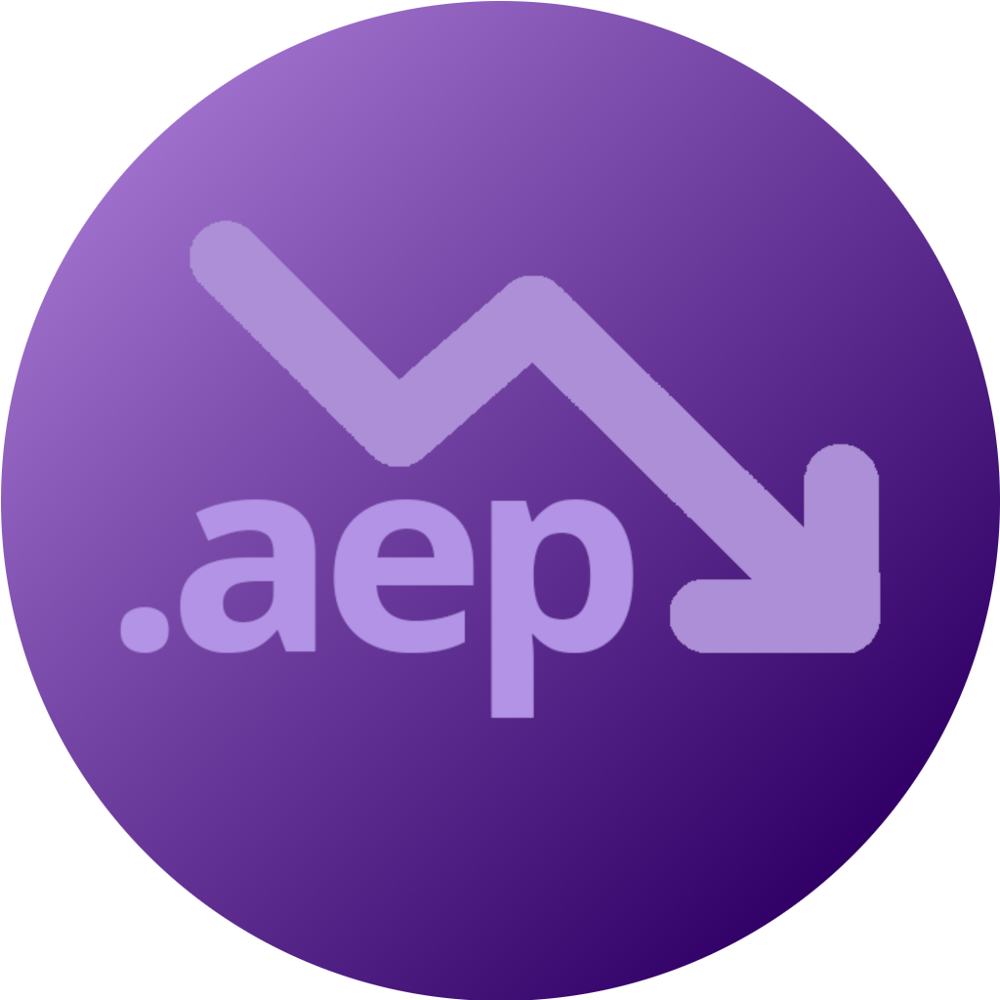

<div align="center">
  <h1>AEP Downgrader</h1>
  <p><strong>Convert Adobe After Effects projects from newer to older versions</strong></p>

  [](LICENSE)
  [](https://github.com/itsAnchorpoint/AEP-Downgrader/releases)
  [](https://github.com/itsAnchorpoint/AEP-Downgrader/stargazers)
  [](https://github.com/itsAnchorpoint/AEP-Downgrader/network/members)

  
</div>

---

## 📋 Table of Contents
- [About](#about)
- [Features](#features)
- [Installation](#installation)
- [Usage](#usage)
- [Supported Versions](#supported-versions)
- [Building from Source](#building-from-source)
- [Creating Releases](#creating-releases)
- [Contributing](#contributing)
- [Icon Requirements](#icon-requirements)
- [License](#license)

## 💡 About

AEP Downgrader is a powerful utility that enables Adobe After Effects users to convert project files from newer versions to older ones. This tool addresses a common challenge in collaborative workflows where team members use different versions of After Effects.

The application features a modern, dark-themed graphical user interface built with PyQt5, providing an intuitive experience for converting AEP files between different After Effects versions.

## ✨ Features

- **Modern UI**: Sleek dark-themed interface with intuitive controls
- **Multi-Version Support**: Convert between multiple After Effects versions (23.x, 24.x, 25.x)
- **Batch Processing**: Convert multiple files at once
- **Automatic Detection**: Automatically detects the source version of AEP files
- **Cross-Platform**: Works on Windows, macOS, and Linux
- **Portable Executables**: Standalone executables with no installation required
- **Version Selection**: Choose target version via checkboxes
- **Progress Tracking**: Visual progress bar for conversion operations

## 🚀 Installation

### Pre-built Binaries (Recommended)

Download the latest release from the [Releases page](https://github.com/itsAnchorpoint/AEP-Downgrader/releases):

- **Windows**: Download `AEP-Downgrader-Windows.zip` and extract
- **macOS**: Download `AEP-Downgrader-macOS.tar.gz` and extract
- **Linux**: Download `AEP-Downgrader-Linux.tar.gz` and extract

### From Source

```bash
git clone https://github.com/itsAnchorpoint/AEP-Downgrader.git
cd AEP-Downgrader
./build_app.sh
```

## 🛠️ Usage

1. Launch the AEP Downgrader application
2. Select one or multiple AEP files to convert
3. The application will automatically detect the source version
4. Select the target version(s) using the checkboxes
5. Click "Convert" to start the conversion process
6. Converted files will be saved in the same directory with version indicators in the filename

## 🔧 Supported Versions

Currently supports conversion between:
- Adobe After Effects 25.x → 24.x
- Adobe After Effects 25.x → 23.x
- Adobe After Effects 24.x → 23.x

More version combinations can be added as needed.

## 🏗️ Building from Source

To build the application yourself:

1. Clone the repository
2. Create a virtual environment: `python -m venv venv`
3. Activate it: `source venv/bin/activate` (Linux/macOS) or `venv\Scripts\activate` (Windows)
4. Install dependencies: `pip install pyinstaller PyQt5`
5. Build: `pyinstaller src/AEPdowngrader.py --onefile --windowed --name AEP-Downgrader`

Platform-specific build instructions are available in:
- BUILD_WINDOWS.md
- BUILD_MACOS.md
- DISTRIBUTION.md

## 📦 Creating Releases

To create a new release with cross-platform binaries:

1. Update the version in relevant files
2. Commit and push your changes
3. Create a new tag: `git tag v1.2.3`
4. Push the tag: `git push origin v1.2.3`
5. GitHub Actions will automatically build and create a release with binaries for all platforms

The release will include binaries for Windows, macOS, and Linux that users can download directly from the Releases page.

## 🤝 Contributing

Feel free to submit issues and pull requests. For major changes, please open an issue first to discuss what you would like to change.

## 🎨 Icon Requirements

The application supports custom icons. To add an icon:

1. Create an icon in PNG format with transparency
2. Recommended sizes: 256x256, 512x512, or 1024x1024 pixels (higher resolution icons will be downscaled as needed)
3. Save the icon as `assets/icon.png` in the project root
4. The application will automatically load and use this icon

For Windows distribution, you may also create an ICO file with multiple resolutions combined into a single file (`assets/icon.ico`).

## 📄 License

GNU General Public License v3.0